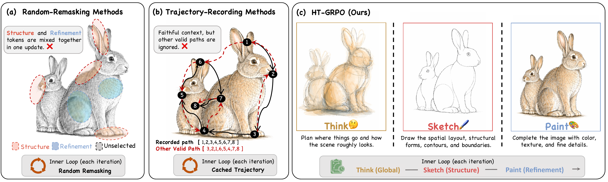
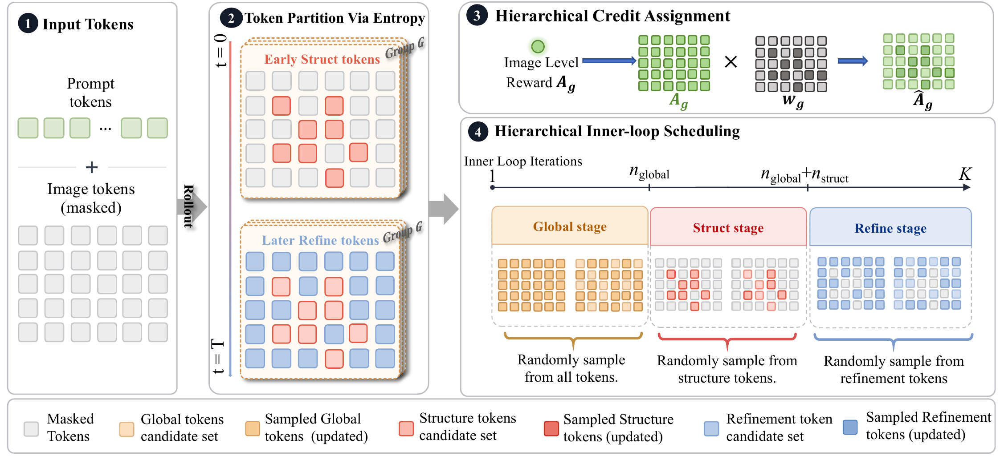
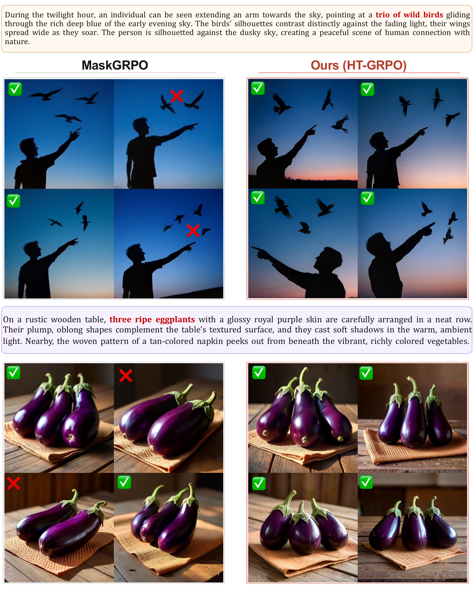
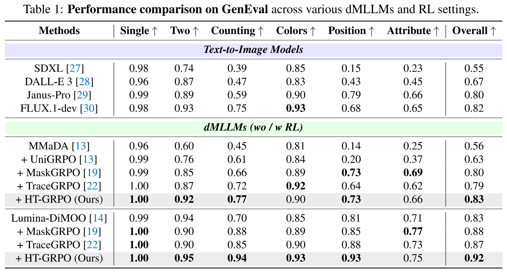
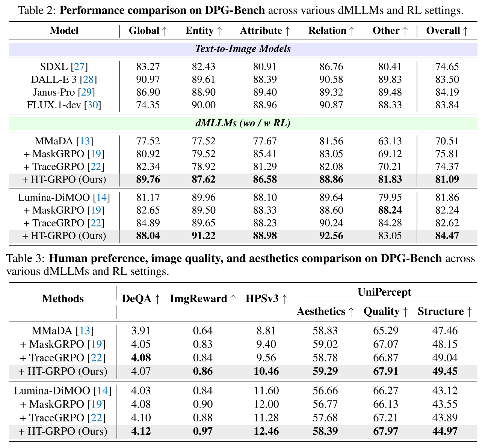

# Sketch Then Paint: Hierarchical Reinforcement Learning for Diffusion Multi-Modal Large Language Models

**HT-GRPO** is a reinforcement learning method for diffusion Multi-Modal Large Language Models. It follows a simple idea: image generation is hierarchical. Early tokens sketch layout and structure, while later tokens paint details. HT-GRPO therefore optimizes visual tokens in a coarse-to-fine way and gives more credit to structural tokens.

**Code and technical report will be released soon.**

<p align="center">
  
</p>

## Method

HT-GRPO uses a **Sketch-Then-Paint** training scheme:

- **Global**: update all visual tokens.
- **Structure**: focus on early tokens for layout, count, and relations.
- **Refinement**: polish local details after the structure is stable.

<p align="center">
  
</p>

## Cases

<details open>
  <summary>Counting and Spatial Grounding</summary>
  
</details>

<details open>
  <summary>GenEval Qualitative Comparison</summary>
  
</details>

## Experiments

HT-GRPO improves both **MMaDA** and **Lumina-DiMOO** on GenEval and DPG-Bench.

<details open>
  <summary>GenEval Benchmark</summary>
  
</details>

<details open>
  <summary>DPG-Bench and Preference Metrics</summary>
  
</details>

## Acknowledgement

This project builds on [MaskGRPO](https://github.com/martian422/MaskGRPO/tree/main), [Lumina-DiMOO](https://github.com/Alpha-VLLM/Lumina-DiMOO), [MMaDA](https://github.com/Gen-Verse/MMaDA), and related open-source projects.

## BibTeX

```bibtex
@article{luo2026sketch,
  title={Sketch Then Paint: Hierarchical Reinforcement Learning for Diffusion Multi-Modal Large Language Models},
  author={Luo, Siqi and Shen, Jianghan and Xin, Yi and Zheng, Huayu and Chen, Haoxing and Tai, Yan and Li, Yue and He, Junjun and Liu, Yihao and Zhai, Guangtao and Cao, Yuewen and Liu, Xiaohong},
  journal={arXiv preprint},
  year={2026}
}
```
